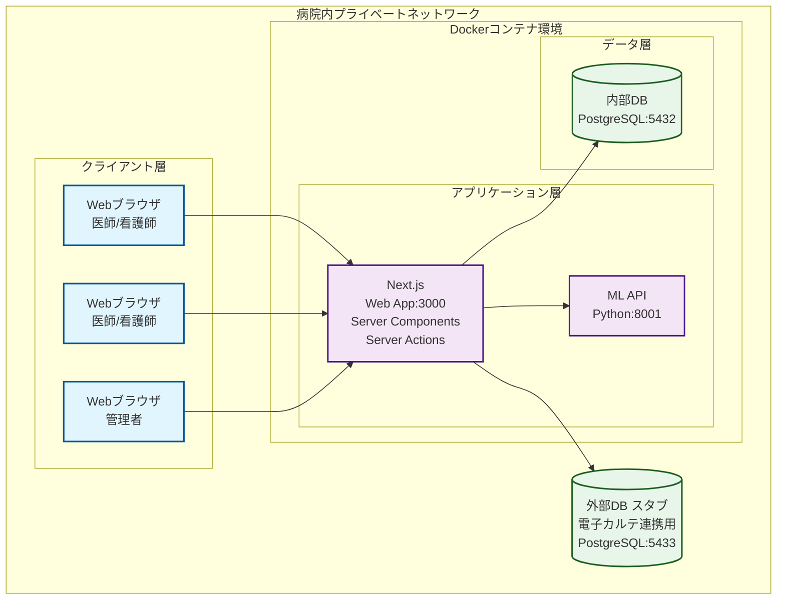
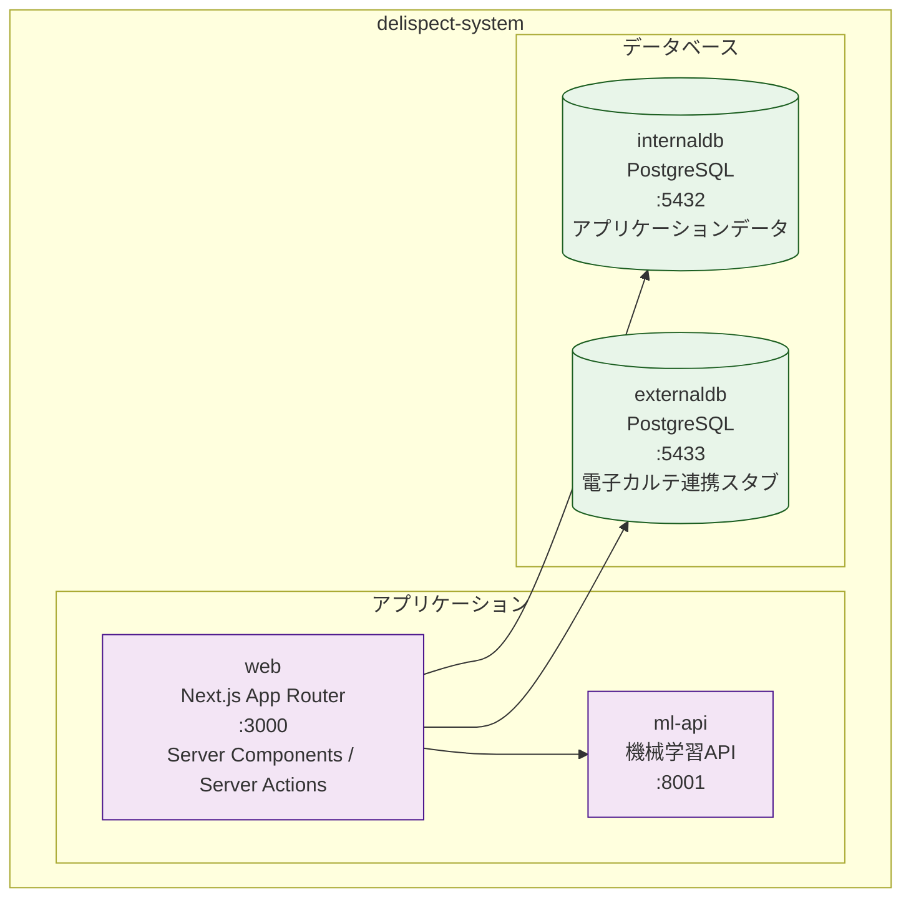

# DELISPECT - システムアーキテクチャ設計書

## 目次

- [DELISPECT - システムアーキテクチャ設計書](#delispect---システムアーキテクチャ設計書)
  - [目次](#目次)
  - [1. 概要](#1-概要)
    - [1.1 目的](#11-目的)
    - [1.2 スコープ](#12-スコープ)
    - [1.3 関連ドキュメント](#13-関連ドキュメント)
  - [2. システムアーキテクチャ](#2-システムアーキテクチャ)
    - [2.1 アーキテクチャ概要](#21-アーキテクチャ概要)
    - [2.2 技術スタック](#22-技術スタック)
  - [3. システム構成](#3-システム構成)
    - [3.1 物理構成](#31-物理構成)
    - [3.2 論理構成](#32-論理構成)
    - [3.3 ネットワーク構成](#33-ネットワーク構成)
  - [文書情報](#文書情報)

## 1. 概要

### 1.1 目的
本文書は、DELISPECTシステムのアーキテクチャ設計を定義し、システム全体の構造、コンポーネント間の関係、技術的な設計判断を文書化することを目的とする。

### 1.2 スコープ
- システム全体のアーキテクチャ設計
- 各コンポーネントの相互作用
- 技術スタック

### 1.3 関連ドキュメント
- [ADR-0001: Monorepo + TypeScript統一](../adr/0001-monorepo-typescript.md)
- [ADR-0003: ML推論の同期API方式](../adr/0003-ml-sync-api.md)
- [ディレクトリ設計ガイドライン](../standards/package-design.md)
- [コーディングガイドライン](../standards/coding-guidelines.md)
- [Server Actionsガイドライン](../standards/server-actions.md)
- [フロントエンドパターン](../standards/frontend-patterns.md)

## 2. システムアーキテクチャ

### 2.1 アーキテクチャ概要

DELISPECTシステムは、TypeScript統一のMonorepo構成を採用する。Webアプリケーション層（フロントエンド・バックエンド）はNext.js App Routerに統合し、機械学習（ML）APIのみPythonで独立サービスとして運用する。

### 2.2 技術スタック

| レイヤー | 技術 | 説明 |
|---------|------|------|
| 言語（Webアプリ） | TypeScript | フロントエンド〜バックエンド統一 |
| Webフレームワーク | Next.js (App Router) | Server Components/Actions によるフルスタック統合 |
| ORM | Prisma | TypeScript型生成、マイグレーション管理 |
| バリデーション | Zod | スキーマ定義によるランタイムバリデーション |
| データベース | PostgreSQL 15 | リレーショナルデータベース |
| ML APIフレームワーク | 未定（Python） | せん妄リスク予測APIの提供 |
| Monorepo管理 | pnpm workspace | ワークスペースによるパッケージ管理 |
| コンテナ | Docker, Docker Compose | コンテナによる実行環境管理 |

## 3. システム構成

### 3.1 物理構成

病院内に設置される単一の物理サーバー上で全コンポーネントを動作させる。

**サーバースペック（推奨）**:
- OS: Ubuntu Server 24.04 LTS
- CPU: Intel Xeon E-2356G 3.2GHz 6コア以上
- メモリ: 16GB以上
- GPU: 未定（deep learning推論の要件に応じて選定）
- ストレージ: SSD 1TB以上（RAID-1構成）
- ネットワーク: 1Gbps以上

### 3.2 論理構成

### 3.3 ネットワーク構成

- 病院内プライベートネットワーク内での動作
- 外部インターネットへの接続は不要（完全クローズド環境対応）
- 各コンテナ間はDockerネットワークで通信

## 文書情報

- 作成日: 2026年02月
- バージョン: v1.0
- 作成者: 波平
- QMS設計書対応番号: DEL-DEV-ARCH-001, DEL-DEV-SYS-001（統合）
- 最終更新: 2026年2月
- 変更履歴:
  - v1.0 - 初版
