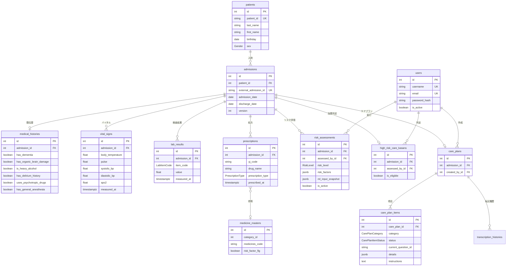
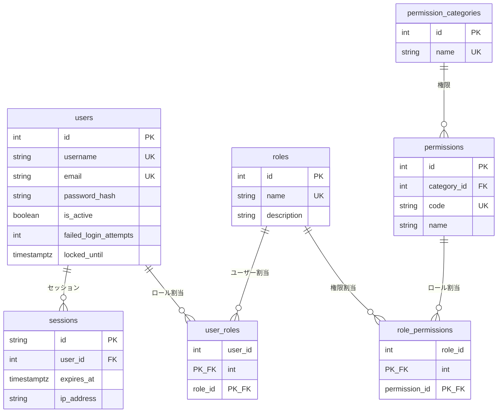
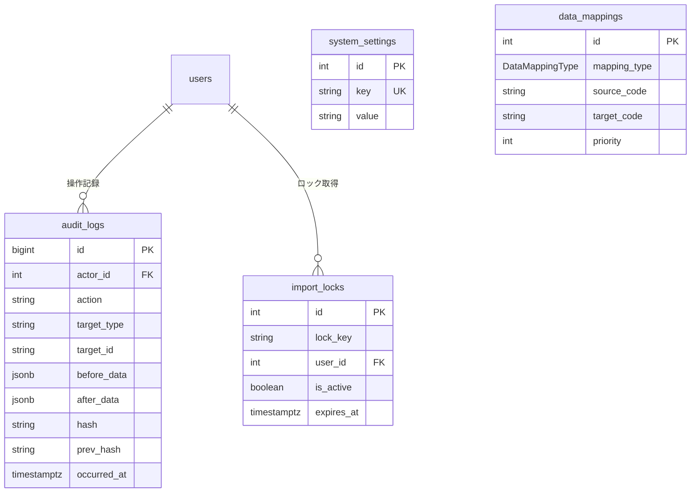

# データベース設計

## 1. 設計方針

### 1.1 基本方針

| 項目     | 選定            | 備考                     |
|--------|---------------|------------------------|
| RDBMS  | PostgreSQL 15 | ACID準拠、JSONB対応         |
| ORM    | Prisma        | 型安全なクエリ、マイグレーション管理     |
| スキーマ定義 | Prisma Schema | Single Source of Truth |

### 1.2 命名規則

| 対象         | 規則               | 例                              |
|------------|------------------|--------------------------------|
| テーブル名（物理）  | snake_case・複数形   | `patients`, `care_plans`       |
| カラム名（物理）   | snake_case       | `admission_date`, `created_at` |
| Enum名      | PascalCase       | `RiskLevel`, `Gender`          |
| Enum値      | UPPER_SNAKE_CASE | `HIGH`, `NOT_STARTED`          |

### 1.3 共通カラム

全テーブルに以下のカラムを付与する（一部例外あり）。

| カラム          | 型              | 説明                            |
|--------------|----------------|-------------------------------|
| `id`         | `SERIAL (INT)` | 主キー（自動採番）                     |
| `created_at` | `TIMESTAMPTZ`  | レコード作成日時                      |
| `updated_at` | `TIMESTAMPTZ`  | レコード更新日時（Prisma `@updatedAt`） |

**例外**:

- `audit_logs`: `updated_at` なし（追記専用テーブル）
- 中間テーブル（`user_roles`, `role_permissions`）: `id` なし（複合PKを使用）

### 1.4 楽観的ロック

同時更新が発生しうるテーブルには `version` カラム（`INT`, デフォルト `0`）を付与する。
更新時に `WHERE version = ?` で排他制御を行い、競合時はエラーを返す。

対象テーブル: `admissions`, `medical_histories`

### 1.5 ソフトデリート

ビジネス上の要件で論理削除が必要なテーブルには `is_active` カラム（`BOOLEAN`, デフォルト `true`）を使用する。

対象テーブル: `risk_assessments`（再評価時に旧レコードを無効化）

### 1.6 監査

すべてのCUD操作は `audit_logs` テーブルに記録する。業務データの書き込みと監査ログの書き込みは同一トランザクション内で実行し、整合性を保証する。

---

## 2. テーブル一覧

### 2.1 ドメイン別テーブル一覧

| #  | ドメイン     | テーブル名                       | 概要                      |
|----|----------|-----------------------------|-------------------------|
| 1  | 患者・入院    | `patients`                  | 患者基本情報                  |
| 2  |          | `admissions`                | 入院情報                    |
| 3  |          | `medical_histories`         | 既往歴・リスク因子（ユーザー入力）       |
| 4  | 臨床データ    | `vital_signs`               | バイタルサイン（電子カルテ連携）        |
| 5  |          | `lab_results`               | 検査結果（電子カルテ連携）           |
| 6  |          | `prescriptions`             | 処方情報（電子カルテ連携）           |
| 7  | リスク評価    | `risk_assessments`          | MLリスク評価結果               |
| 8  | 加算判定     | `high_risk_care_kasans`     | せん妄ハイリスクケア加算判定          |
| 9  | ケアプラン    | `care_plans`                | ケアプランヘッダー               |
| 10 |          | `care_plan_items`           | ケアプラン項目（カテゴリ別ステータス・詳細データ） |
| 11 |          | `transcription_histories`   | 看護記録転記履歴                |
| 12 | ユーザー・認可  | `users`                     | ユーザー情報                  |
| 13 |          | `sessions`                  | セッション管理                 |
| 14 |          | `roles`                     | ロール定義                   |
| 15 |          | `user_roles`                | ユーザー・ロール紐付け             |
| 16 |          | `permissions`               | 権限定義                    |
| 17 |          | `permission_categories`     | 権限カテゴリ                  |
| 18 |          | `role_permissions`          | ロール・権限紐付け               |
| 19 | マスタ      | `medicine_masters`          | 薬剤マスタ                   |
| 20 |          | `medicine_name_settings`    | 病院別薬剤名称設定               |
| 21 |          | `reference_value_masters`          | バイタル・検査基準値              |
| 22 | データマッピング | `data_mappings`             | 病院コード変換マッピング            |
| 23 | システム     | `audit_logs`                | 監査ログ                    |
| 24 |          | `import_locks`              | インポート排他ロック              |
| 25 |          | `system_settings`           | システム設定                  |

---

## 3. ER図

### 3.1 コアドメインER図



### 3.2 ユーザー・認可ER図



### 3.3 システム管理ER図



---

## 4. テーブル定義

### 4.1 患者・入院ドメイン

#### patients（患者）

患者の基本情報を管理する。電子カルテ側で採番された患者IDを保持する。

| カラム               | 型             | NULL | デフォルト   | 説明              |
|-------------------|---------------|------|---------|-----------------|
| `id`              | `SERIAL`      | NO   | 自動採番    | 主キー             |
| `patient_id`      | `VARCHAR(20)` | NO   | -       | 電子カルテ患者ID（ユニーク） |
| `last_name`       | `VARCHAR(50)` | NO   | -       | 姓               |
| `first_name`      | `VARCHAR(50)` | NO   | -       | 名               |
| `last_name_kana`  | `VARCHAR(50)` | YES  | -       | 姓（カナ）           |
| `first_name_kana` | `VARCHAR(50)` | YES  | -       | 名（カナ）           |
| `birthday`        | `DATE`        | NO   | -       | 生年月日            |
| `sex`             | `Gender`      | NO   | -       | 性別              |
| `created_at`      | `TIMESTAMPTZ` | NO   | `now()` | 作成日時            |
| `updated_at`      | `TIMESTAMPTZ` | NO   | 自動更新    | 更新日時            |

**制約**:

- PK: `id`
- UQ: `patient_id`

**インデックス**:

- `patient_id` UNIQUE（電子カルテ患者IDによる検索）

**リレーション**:

- `patients` 1 → N `admissions`

---

#### admissions（入院）

入院情報を管理する。患者の複数回入院に対応する。臨床データ・リスク評価・ケアプラン等の起点となる中心テーブル。

| カラム                     | 型              | NULL | デフォルト   | 説明                |
|-------------------------|----------------|------|---------|-------------------|
| `id`                    | `SERIAL`       | NO   | 自動採番    | 主キー               |
| `patient_id`            | `INT`          | NO   | -       | FK: `patients.id` |
| `external_admission_id` | `VARCHAR(30)`  | NO   | -       | 電子カルテ入院ID（ユニーク）   |
| `admission_date`        | `DATE`         | NO   | -       | 入院日               |
| `admission_time`        | `TIME`         | YES  | -       | 入院時刻              |
| `age_at_admission`      | `INT`          | YES  | -       | 入院時年齢             |
| `height`                | `DECIMAL(5,1)` | YES  | -       | 身長（cm）            |
| `weight`                | `DECIMAL(5,1)` | YES  | -       | 体重（kg）            |
| `discharge_date`        | `DATE`         | YES  | -       | 退院日               |
| `ward`                  | `VARCHAR(50)`  | YES  | -       | 病棟                |
| `room`                  | `VARCHAR(50)`  | YES  | -       | 病室                |
| `version`               | `INT`          | NO   | `0`     | 楽観的ロック用バージョン      |
| `created_at`            | `TIMESTAMPTZ`  | NO   | `now()` | 作成日時              |
| `updated_at`            | `TIMESTAMPTZ`  | NO   | 自動更新    | 更新日時              |

**制約**:

- PK: `id`
- FK: `patient_id` → `patients(id)`
- UQ: `external_admission_id`

**インデックス**:

- `patient_id`（患者の入院一覧取得）
- `admission_date`（入院日による絞り込み）
- `external_admission_id` UNIQUE（電子カルテ入院IDによる検索）

**リレーション**:

- `patients` 1 → N `admissions`
- `admissions` 1 → 0..1 `medical_histories`
- `admissions` 1 → N `vital_signs`
- `admissions` 1 → N `lab_results`
- `admissions` 1 → N `prescriptions`
- `admissions` 1 → N `risk_assessments`
- `admissions` 1 → 0..1 `high_risk_care_kasans`
- `admissions` 1 → 0..1 `care_plans`

---

#### medical_histories（既往歴・リスク因子）

ユーザーが入力する既往歴・リスク因子情報。ML予測とハイリスクケア加算判定の両方の入力として使用される。

| カラム                        | 型              | NULL | デフォルト   | 説明                        |
|----------------------------|----------------|------|---------|---------------------------|
| `id`                       | `SERIAL`       | NO   | 自動採番    | 主キー                       |
| `admission_id`             | `INT`          | NO   | -       | FK: `admissions.id`（ユニーク） |
| `has_dementia`             | `BOOLEAN`      | YES  | -       | 認知症                       |
| `has_organic_brain_damage` | `BOOLEAN`      | YES  | -       | 脳器質的障害                    |
| `is_heavy_alcohol`         | `BOOLEAN`      | YES  | -       | アルコール多飲                   |
| `has_delirium_history`     | `BOOLEAN`      | YES  | -       | せん妄既往                     |
| `uses_psychotropic_drugs`  | `BOOLEAN`      | YES  | -       | 向精神薬使用                    |
| `has_general_anesthesia`   | `BOOLEAN`      | YES  | -       | 全身麻酔                      |
| `has_emergency_surgery`    | `BOOLEAN`      | YES  | -       | 緊急手術                      |
| `has_scheduled_surgery`    | `BOOLEAN`      | YES  | -       | 予定手術                      |
| `has_head_neck_surgery`    | `BOOLEAN`      | YES  | -       | 頭頸部手術                     |
| `has_chest_surgery`        | `BOOLEAN`      | YES  | -       | 胸部手術                      |
| `has_abdominal_surgery`    | `BOOLEAN`      | YES  | -       | 腹部手術                      |
| `has_admission_oxygen_use` | `BOOLEAN`      | YES  | -       | 入院時酸素使用                   |
| `oxygen_level`             | `DECIMAL(4,1)` | YES  | -       | 入院時酸素投与量（L/min）           |
| `version`                  | `INT`          | NO   | `0`     | 楽観的ロック用バージョン              |
| `created_at`               | `TIMESTAMPTZ`  | NO   | `now()` | 作成日時                      |
| `updated_at`               | `TIMESTAMPTZ`  | NO   | 自動更新    | 更新日時                      |

**制約**:

- PK: `id`
- FK: `admission_id` → `admissions(id)`
- UQ: `admission_id`（1入院に対し1レコード）

**備考**:

- ドメインモデル上は5項目（認知症・脳器質的障害・アルコール多飲・せん妄既往・全身麻酔）だが、ML予測に必要な手術・酸素関連の項目も本テーブルに含める
- ハイリスクケア加算判定の「70歳以上」は `patients.birthday` から算出、「リスク薬剤」は `prescriptions` + `medicine_masters`
  から判定するため、本テーブルには含まない

---

### 4.2 臨床データドメイン（電子カルテ連携）

#### vital_signs（バイタルサイン）

電子カルテから取得したバイタルサイン。1入院に対し複数レコード。データ期間は入院日〜入院翌日。

| カラム                | 型              | NULL | デフォルト   | 説明                  |
|--------------------|----------------|------|---------|---------------------|
| `id`               | `SERIAL`       | NO   | 自動採番    | 主キー                 |
| `admission_id`     | `INT`          | NO   | -       | FK: `admissions.id` |
| `body_temperature` | `DECIMAL(4,1)` | YES  | -       | 体温（℃）               |
| `pulse`            | `INT`          | YES  | -       | 脈拍（bpm）             |
| `systolic_bp`      | `INT`          | YES  | -       | 収縮期血圧（mmHg）         |
| `diastolic_bp`     | `INT`          | YES  | -       | 拡張期血圧（mmHg）         |
| `spo2`             | `DECIMAL(4,1)` | YES  | -       | SpO2（%）             |
| `respiratory_rate`      | `INT`          | YES  | -       | 呼吸数（回/min）          |
| `measured_at`           | `TIMESTAMPTZ`  | NO   | -       | 代表測定日時（Upsert・表示用）  |
| `body_temperature_at`   | `TIMESTAMPTZ`  | YES  | -       | 体温測定日時              |
| `pulse_at`              | `TIMESTAMPTZ`  | YES  | -       | 脈拍測定日時              |
| `systolic_bp_at`        | `TIMESTAMPTZ`  | YES  | -       | 収縮期血圧測定日時           |
| `diastolic_bp_at`       | `TIMESTAMPTZ`  | YES  | -       | 拡張期血圧測定日時           |
| `spo2_at`               | `TIMESTAMPTZ`  | YES  | -       | SpO2測定日時             |
| `respiratory_rate_at`   | `TIMESTAMPTZ`  | YES  | -       | 呼吸数測定日時             |
| `created_at`            | `TIMESTAMPTZ`  | NO   | `now()` | 作成日時                |
| `updated_at`            | `TIMESTAMPTZ`  | NO   | 自動更新    | 更新日時                |

**制約**:

- PK: `id`
- FK: `admission_id` → `admissions(id)`
- UQ: `(admission_id, measured_at)`（同一入院・同一日時の重複防止）

**インデックス**:

- `(admission_id, measured_at)` UNIQUE（Upsert用・時系列検索）

**備考**:

- 旧スキーマ `T_PatientMeasurement` ではバイタルと検査値が1行にまとまっていたが、ドメインモデルに合わせてバイタルと検査結果を分離
- バイタルサインは1レコードに各項目をまとめる（正規化しない）
- `measured_at` は画面表示・Upsert用の代表日時。各項目の正確な測定日時は `*_at` カラムに保持する
- 電子カルテ同期時はUpsert（`admission_id` + `measured_at` で一意特定）

---

#### lab_results（検査結果）

電子カルテから取得した採血検査結果。1入院に対し複数レコード（項目別・測定日別）。データ期間は入院7日前〜入院翌日。

| カラム            | 型               | NULL | デフォルト   | 説明                  |
|----------------|-----------------|------|---------|---------------------|
| `id`           | `SERIAL`        | NO   | 自動採番    | 主キー                 |
| `admission_id` | `INT`           | NO   | -       | FK: `admissions.id` |
| `item_code`    | `LabItemCode`   | NO   | -       | 検査項目コード             |
| `value`        | `DECIMAL(10,3)` | NO   | -       | 検査値                 |
| `measured_at`  | `TIMESTAMPTZ`   | NO   | -       | 測定日時                |
| `created_at`   | `TIMESTAMPTZ`   | NO   | `now()` | 作成日時                |
| `updated_at`   | `TIMESTAMPTZ`   | NO   | 自動更新    | 更新日時                |

**制約**:

- PK: `id`
- FK: `admission_id` → `admissions(id)`
- UQ: `(admission_id, item_code, measured_at)`（同一入院・同一項目・同一日時の重複防止）

**インデックス**:

- `(admission_id, item_code, measured_at)` UNIQUE（Upsert用・項目別検索）

**備考**:

- 旧スキーマでは1入院1レコードの横持ちテーブル（49カラム）だったが、検査項目別・測定日別の縦持ちに正規化
- 項目の追加が容易（Enumに値を追加するのみ）
- 病院ごとに異なる検査コードは `data_mappings` で変換し、`item_code` にはシステム統一コードを格納

---

#### prescriptions（処方）

電子カルテから取得した処方情報。内服（処方オーダ）と注射（注射オーダ）の2種類を統合管理する。

| カラム                 | 型                  | NULL | デフォルト   | 説明                     |
|---------------------|--------------------|------|---------|------------------------|
| `id`                | `SERIAL`           | NO   | 自動採番    | 主キー                    |
| `admission_id`      | `INT`              | NO   | -       | FK: `admissions.id`    |
| `prescription_type` | `PrescriptionType` | NO   | -       | 処方種別（ORAL / INJECTION） |
| `yj_code`           | `VARCHAR(12)`      | YES  | -       | YJコード（薬剤コード）           |
| `drug_name`         | `VARCHAR(200)`     | YES  | -       | 薬剤名                    |
| `usage_volume`      | `DECIMAL(10,3)`    | YES  | -       | 投与量                    |
| `unit`              | `VARCHAR(20)`      | YES  | -       | 単位                     |
| `administration`    | `VARCHAR(200)`     | YES  | -       | 用法（例：「1日1回朝食後」）        |
| `doses_per_day`     | `INT`              | YES  | -       | 1日回数（0=不定期）            |
| `prescriber`            | `VARCHAR(100)`     | YES  | -       | 処方医                    |
| `medicines_comment`     | `TEXT`             | YES  | -       | 薬剤コメント                 |
| `administration_comment`| `TEXT`             | YES  | -       | 用法コメント                 |
| `prescribed_at`         | `TIMESTAMPTZ`      | YES  | -       | 処方日時                   |
| `created_at`        | `TIMESTAMPTZ`      | NO   | `now()` | 作成日時                   |
| `updated_at`        | `TIMESTAMPTZ`      | NO   | 自動更新    | 更新日時                   |

**制約**:

- PK: `id`
- FK: `admission_id` → `admissions(id)`

**インデックス**:

- `admission_id`（入院別処方一覧）
- `yj_code`（薬剤コードによる検索）

**備考**:

- `yj_code` を介して `medicine_masters` と論理的に参照関係を持つ（YJコード上位7桁で照合）
- 旧スキーマでは `unit` がEnum型だったが、病院間で単位表記が異なるため文字列型に変更
- リスク薬剤の判定はアプリケーション層で `yj_code` と `medicine_masters` を突き合わせて行う

---

### 4.3 リスク評価ドメイン

#### risk_assessments（リスク評価）

MLモデルによるせん妄リスク評価結果。基本的に1入院1回だが、再実施が可能。再実施時は旧レコードを `is_active = false`
に更新し、新レコードを作成する。

| カラム                 | 型             | NULL | デフォルト   | 説明                                 |
|---------------------|---------------|------|---------|------------------------------------|
| `id`                | `SERIAL`      | NO   | 自動採番    | 主キー                                |
| `admission_id`      | `INT`         | NO   | -       | FK: `admissions.id`                |
| `assessed_by_id`    | `INT`         | NO   | -       | FK: `users.id`（実行者）                |
| `assessed_at`       | `TIMESTAMPTZ` | NO   | -       | 評価日時                               |
| `risk_level`        | `RiskLevel`   | NO   | -       | リスクレベル（HIGH / LOW / INDETERMINATE） |
| `risk_factors`      | `JSONB`       | YES  | -       | リスク因子詳細（ML出力）                      |
| `ml_input_snapshot` | `JSONB`       | YES  | -       | 評価時のML入力データスナップショット                |
| `missing_items`     | `JSONB`       | YES  | -       | 不足項目リスト（判定不能時）                     |
| `is_active`         | `BOOLEAN`     | NO   | `true`  | 有効フラグ（再評価時に旧レコードを無効化）              |
| `created_at`        | `TIMESTAMPTZ` | NO   | `now()` | 作成日時                               |
| `updated_at`        | `TIMESTAMPTZ` | NO   | 自動更新    | 更新日時                               |

**制約**:

- PK: `id`
- FK: `admission_id` → `admissions(id)`
- FK: `assessed_by_id` → `users(id)`

**インデックス**:

- `(admission_id) WHERE is_active = true`（有効な評価を高速に取得）

**備考**:

- `ml_input_snapshot` にはバイタル・検査値・既往歴等の入力データを評価ごとに保存（要件: 機械学習入力情報も評価ごとに毎回保存する）
- ハイリスクケア加算判定（`high_risk_care_kasans`）が先に実施されている必要がある（アプリケーション層で制御）

---

### 4.4 ハイリスクケア加算ドメイン

#### high_risk_care_kasans（せん妄ハイリスクケア加算判定）

せん妄ハイリスクケア加算のアセスメント結果。1入院に対し1レコード。リスク評価・ケアプランとは独立した判定。

| カラム                        | 型             | NULL | デフォルト   | 説明                        |
|----------------------------|---------------|------|---------|---------------------------|
| `id`                       | `SERIAL`      | NO   | 自動採番    | 主キー                       |
| `admission_id`             | `INT`         | NO   | -       | FK: `admissions.id`（ユニーク） |
| `assessed_by_id`           | `INT`         | NO   | -       | FK: `users.id`（判定者）       |
| `assessed_at`              | `TIMESTAMPTZ` | NO   | -       | 判定日時                      |
| `is_eligible`              | `BOOLEAN`     | NO   | -       | 加算対象（1項目でも該当すればtrue）      |
| `is_seventy_or_above`      | `BOOLEAN`     | NO   | `false` | 70歳以上                     |
| `has_dementia`             | `BOOLEAN`     | NO   | `false` | 認知症                       |
| `has_organic_brain_damage` | `BOOLEAN`     | NO   | `false` | 脳器質的障害                    |
| `is_heavy_alcohol`         | `BOOLEAN`     | NO   | `false` | アルコール多飲                   |
| `has_delirium_history`     | `BOOLEAN`     | NO   | `false` | せん妄既往                     |
| `has_risk_drug`            | `BOOLEAN`     | NO   | `false` | リスク薬剤あり                   |
| `has_general_anesthesia`   | `BOOLEAN`     | NO   | `false` | 全身麻酔                      |
| `created_at`               | `TIMESTAMPTZ` | NO   | `now()` | 作成日時                      |
| `updated_at`               | `TIMESTAMPTZ` | NO   | 自動更新    | 更新日時                      |

**制約**:

- PK: `id`
- FK: `admission_id` → `admissions(id)`
- FK: `assessed_by_id` → `users(id)`
- UQ: `admission_id`（1入院に対し1レコード）

**備考**:

- `is_seventy_or_above` は `patients.birthday` から算出してユーザー確認後に保存
- `has_risk_drug` は `prescriptions` + `medicine_masters` から判定してユーザー確認後に保存
- 既往歴関連項目（`has_dementia` 等）は `medical_histories` と重複するが、加算判定結果として独立保存（判定時点のスナップショット）

---

### 4.5 ケアプランドメイン

#### care_plans（ケアプラン）

ケアプランのヘッダーテーブル。リスク評価で「高リスク」と判定された入院に対し作成される。

| カラム             | 型             | NULL | デフォルト   | 説明                        |
|-----------------|---------------|------|---------|---------------------------|
| `id`            | `SERIAL`      | NO   | 自動採番    | 主キー                       |
| `admission_id`  | `INT`         | NO   | -       | FK: `admissions.id`（ユニーク） |
| `created_by_id` | `INT`         | NO   | -       | FK: `users.id`（作成者）       |
| `created_at`    | `TIMESTAMPTZ` | NO   | `now()` | 作成日時                      |
| `updated_at`    | `TIMESTAMPTZ` | NO   | 自動更新    | 更新日時                      |

**制約**:

- PK: `id`
- FK: `admission_id` → `admissions(id)`
- FK: `created_by_id` → `users(id)`
- UQ: `admission_id`

**備考**:

- ケアプラン全体のステータスは `care_plan_items` のステータスから導出する（テーブルには持たない）
    - 全項目が `NOT_STARTED` → `NOT_STARTED`
    - 一部でも `IN_PROGRESS` または `COMPLETED` → `IN_PROGRESS`
    - 全項目が `COMPLETED` → `COMPLETED`

---

#### care_plan_items（ケアプラン項目）

ケアプランのカテゴリ別ステータス管理・詳細データテーブル。1ケアプランに対し10カテゴリ分のレコードが作成される。各カテゴリの問診回答データは `details` (JSONB) に格納する。

| カラム                   | 型                    | NULL | デフォルト         | 説明                                       |
|-----------------------|----------------------|------|---------------|------------------------------------------|
| `id`                  | `SERIAL`             | NO   | 自動採番          | 主キー                                      |
| `care_plan_id`        | `INT`                | NO   | -             | FK: `care_plans.id`                      |
| `category`            | `CarePlanCategory`   | NO   | -             | ケアプランカテゴリ（10種）                           |
| `status`              | `CarePlanItemStatus` | NO   | `NOT_STARTED` | ステータス                                    |
| `current_question_id` | `VARCHAR(20)`        | YES  | -             | 最後に回答した設問ID（問診フロー中の進捗追跡）                 |
| `details`             | `JSONB`              | YES  | -             | カテゴリ固有の問診回答データ（下記JSONスキーマ参照）              |
| `instructions`        | `TEXT`               | YES  | -             | ケア提案指示ID（例: MED_A1, PAIN_A2, DEHY_A3） |
| `started_at`          | `TIMESTAMPTZ`        | YES  | -             | 開始日時                                     |
| `completed_at`        | `TIMESTAMPTZ`        | YES  | -             | 完了日時                                     |
| `created_at`          | `TIMESTAMPTZ`        | NO   | `now()`       | 作成日時                                     |
| `updated_at`          | `TIMESTAMPTZ`        | NO   | 自動更新          | 更新日時                                     |

**制約**:

- PK: `id`
- FK: `care_plan_id` → `care_plans(id)`
- UQ: `(care_plan_id, category)`（1ケアプランにつき各カテゴリ1レコード）

**インデックス**:

- `(care_plan_id, category)` UNIQUE（カテゴリ別アイテム取得）

**備考**:

- カテゴリは10種固定: 薬剤・疼痛・脱水・便秘・炎症・離床・認知症・安全管理・睡眠・情報提供
- ステータス遷移: `NOT_STARTED` → `IN_PROGRESS` → `COMPLETED`（PROVIDING_INFORMATION は `NOT_STARTED` → `COMPLETED`）
- `details` のJSONスキーマはカテゴリごとに異なる。アプリケーション層でZodスキーマによるバリデーションを行う
- データは常にカテゴリ単位で一括読み書きされるため、フィールド単位のDB検索は不要

#### details JSONスキーマ（カテゴリ別）

**共通型: TernaryOption**

問診の回答項目には三値型 `TernaryOption` を使用する。`"yes"` / `"no"` / `"unknown"`（不明）の3値をとり、未回答時は `null`。

##### MEDICINE（薬剤）

```json
{
  "hasRiskMedicine": true,
  "hasNarcotic": false,
  "isOverdose": null
}
```

| フィールド | 型 | 説明 |
|-----------|------|------|
| `hasRiskMedicine` | `boolean \| null` | リスク薬剤あり |
| `hasNarcotic` | `boolean \| null` | 麻薬あり |
| `isOverdose` | `boolean \| null` | 麻薬過量投与チェック |

##### PAIN（疼痛）

```json
{
  "hasPain": "yes",
  "isNightAwakening": "unknown",
  "sites": [
    {
      "site": "t1,t2",
      "painOnTouch": "yes",
      "painOnTouchDetail": "...",
      "painOnMove": "no",
      "painOnMoveDetail": null,
      "numbness": "yes",
      "numbnessDetail": "...",
      "remarks": null
    }
  ],
  "influenceOnSleep": "yes",
  "influenceOnSleepDesc": "...",
  "influenceOnMove": "no",
  "influenceOnMoveDesc": null,
  "influenceOnExcretion": "no",
  "influenceOnExcretionDesc": null,
  "influenceRemarks": null
}
```

| フィールド | 型 | 説明 |
|-----------|------|------|
| `hasPain` | `TernaryOption \| null` | 痛みあり |
| `isNightAwakening` | `TernaryOption \| null` | 夜間覚醒あり |
| `sites` | `PainSite[]` | 疼痛部位（デルマトーム、複数可） |
| `sites[].site` | `string` | 部位コード（カンマ区切り） |
| `sites[].painOnTouch` | `TernaryOption \| null` | 触った時の痛み |
| `sites[].painOnTouchDetail` | `string \| null` | 詳細 |
| `sites[].painOnMove` | `TernaryOption \| null` | 動かした時の痛み |
| `sites[].painOnMoveDetail` | `string \| null` | 詳細 |
| `sites[].numbness` | `TernaryOption \| null` | 違和感・しびれ |
| `sites[].numbnessDetail` | `string \| null` | 詳細 |
| `sites[].remarks` | `string \| null` | 備考 |
| `influenceOnSleep` | `TernaryOption \| null` | 睡眠への影響 |
| `influenceOnSleepDesc` | `string \| null` | 詳細 |
| `influenceOnMove` | `TernaryOption \| null` | 動作への影響 |
| `influenceOnMoveDesc` | `string \| null` | 詳細 |
| `influenceOnExcretion` | `TernaryOption \| null` | 排泄への影響 |
| `influenceOnExcretionDesc` | `string \| null` | 詳細 |
| `influenceRemarks` | `string \| null` | 生活影響の備考 |

##### DEHYDRATION（脱水）

```json
{
  "isAbnormalBlood": "yes",
  "isAbnormalVital": "no",
  "skinCondition": "NORMAL",
  "oralCondition": "ABNORMAL",
  "isLightheadedness": "no",
  "urineCondition": "UNKNOWN",
  "isHydrationWithin12h": "yes",
  "isHydration1lOrMore": "no",
  "canDrinkWater": "yes"
}
```

| フィールド | 型 | 説明 |
|-----------|------|------|
| `isAbnormalBlood` | `TernaryOption \| null` | 採血データ異常（Ht, Hb） |
| `isAbnormalVital` | `TernaryOption \| null` | 脈拍・血圧異常 |
| `skinCondition` | `"UNKNOWN" \| "NORMAL" \| "ABNORMAL" \| null` | 皮膚の状態 |
| `oralCondition` | `"UNKNOWN" \| "NORMAL" \| "ABNORMAL" \| null` | 口腔の状態 |
| `isLightheadedness` | `TernaryOption \| null` | たちくらみ・ふらつき |
| `urineCondition` | `"UNKNOWN" \| "NORMAL" \| "ABNORMAL" \| null` | 尿の状態 |
| `isHydrationWithin12h` | `TernaryOption \| null` | 12時間以内の補水あり |
| `isHydration1lOrMore` | `TernaryOption \| null` | 1日1L以上の水分摂取 |
| `canDrinkWater` | `TernaryOption \| null` | 経口摂水可能 |

##### CONSTIPATION（便秘）

```json
{
  "isOver3d": "yes",
  "hardness": "HARD",
  "isBowelMovementAbnormal": "no",
  "hasFart": "yes",
  "isGasBuildup": "no",
  "isTouchStool": "no",
  "canUseLaxative": "yes",
  "hasNausea": "no",
  "hasStomachAche": "no",
  "hasAppetite": "yes",
  "foodVolume": "MEDIUM"
}
```

| フィールド | 型 | 説明 |
|-----------|------|------|
| `isOver3d` | `TernaryOption \| null` | 3日以上排便なし |
| `hardness` | `"HARD" \| "NORMAL" \| "SOFT" \| "UNKNOWN" \| null` | 便の硬さ |
| `isBowelMovementAbnormal` | `TernaryOption \| null` | 腸蠕動音異常 |
| `hasFart` | `TernaryOption \| null` | 放屁あり |
| `isGasBuildup` | `TernaryOption \| null` | ガス貯留 |
| `isTouchStool` | `TernaryOption \| null` | 触診で便塊あり |
| `canUseLaxative` | `TernaryOption \| null` | 下剤使用経験あり |
| `hasNausea` | `TernaryOption \| null` | 吐き気あり |
| `hasStomachAche` | `TernaryOption \| null` | 腹痛あり |
| `hasAppetite` | `TernaryOption \| null` | 食欲あり |
| `foodVolume` | `"LARGE" \| "MEDIUM" \| "SMALL" \| "UNKNOWN" \| null` | 食事量 |

##### INFLAMMATION（炎症）

```json
{
  "isAbnormalBlood": "yes",
  "isAbnormalVital": "no",
  "hasPain": "no"
}
```

| フィールド | 型 | 説明 |
|-----------|------|------|
| `isAbnormalBlood` | `TernaryOption \| null` | 採血データ異常（CRP, WBC） |
| `isAbnormalVital` | `TernaryOption \| null` | 脈拍・血圧・SpO2異常 |
| `hasPain` | `TernaryOption \| null` | 炎症に伴う痛みあり |

##### MOBILIZATION / DEMENTIA / SAFETY / SLEEP（離床・認知症・安全管理・睡眠）

チェックリスト形式。各カテゴリで選択された対策項目を配列で保持する。

```json
{
  "selectedItems": ["ITEM_001", "ITEM_003"]
}
```

| フィールド | 型 | 説明 |
|-----------|------|------|
| `selectedItems` | `string[]` | 選択された対策項目IDのリスト |

##### PROVIDING_INFORMATION（情報提供）

PDF閲覧による情報提供確認。問診フローはなく、PDF閲覧ページに遷移して保存すれば完了となる。`details` は `null`（ステータスと `completed_at` で管理）。

---

#### transcription_histories（看護記録転記履歴）

ケアプランの看護記録への転記履歴を管理する。

| カラム                 | 型             | NULL | デフォルト   | 説明                    |
|---------------------|---------------|------|---------|-----------------------|
| `id`                | `SERIAL`      | NO   | 自動採番    | 主キー                   |
| `care_plan_id`      | `INT`         | NO   | -       | FK: `care_plans.id`   |
| `content`           | `TEXT`        | NO   | -       | 転記テキスト内容              |
| `transcribed_by_id` | `INT`         | NO   | -       | FK: `users.id`（転記実行者） |
| `transcribed_at`    | `TIMESTAMPTZ` | NO   | -       | 転記日時                  |
| `created_at`        | `TIMESTAMPTZ` | NO   | `now()` | 作成日時                  |

**制約**:

- PK: `id`
- FK: `care_plan_id` → `care_plans(id)`
- FK: `transcribed_by_id` → `users(id)`

---

### 4.6 ユーザー・認可ドメイン

#### users（ユーザー）

システムのユーザー情報。認証・セッション管理の主体。

| カラム                     | 型              | NULL | デフォルト   | 説明                    |
|-------------------------|----------------|------|---------|-----------------------|
| `id`                    | `SERIAL`       | NO   | 自動採番    | 主キー                   |
| `username`              | `VARCHAR(50)`  | NO   | -       | ユーザーID（ログインID、変更不可）   |
| `email`                 | `VARCHAR(255)` | NO   | -       | メールアドレス               |
| `first_name`            | `VARCHAR(50)`  | NO   | -       | 名                     |
| `last_name`             | `VARCHAR(50)`  | NO   | -       | 姓                     |
| `password_hash`         | `VARCHAR(255)` | NO   | -       | パスワードハッシュ（Argon2id）   |
| `is_active`             | `BOOLEAN`      | NO   | `true`  | アカウント有効フラグ            |
| `failed_login_attempts` | `INT`          | NO   | `0`     | ログイン失敗回数              |
| `locked_until`          | `TIMESTAMPTZ`  | YES  | -       | ロック解除日時（5回失敗で24時間ロック） |
| `created_at`            | `TIMESTAMPTZ`  | NO   | `now()` | 作成日時                  |
| `updated_at`            | `TIMESTAMPTZ`  | NO   | 自動更新    | 更新日時                  |

**制約**:

- PK: `id`
- UQ: `username`
- UQ: `email`

**備考**:

- NextAuth Credentials Providerと連携。セッション管理はDB-backed session
- パスワード要件: 12文字以上、大文字・小文字・数字・記号の組み合わせ（アプリケーション層でバリデーション）
- 5回ログイン失敗 → 24時間自動ロック。管理者によるリセットも可能

---

#### sessions（セッション）

ユーザーセッション管理。

| カラム          | 型              | NULL | デフォルト   | 説明             |
|--------------|----------------|------|---------|----------------|
| `id`         | `VARCHAR(255)` | NO   | -       | セッションID（主キー）   |
| `user_id`    | `INT`          | NO   | -       | FK: `users.id` |
| `expires_at` | `TIMESTAMPTZ`  | NO   | -       | セッション有効期限      |
| `ip_address` | `VARCHAR(45)`  | YES  | -       | アクセス元IPアドレス    |
| `user_agent` | `TEXT`         | YES  | -       | ユーザーエージェント     |
| `created_at` | `TIMESTAMPTZ`  | NO   | `now()` | 作成日時           |

**制約**:

- PK: `id`
- FK: `user_id` → `users(id)` ON DELETE CASCADE

**備考**:

- 30分間操作がない場合にタイムアウト
- 新規ログイン時は同一ユーザーの既存セッションを無効化（1ユーザー1セッション）
- セッションIDは定期的に再生成

---

#### roles（ロール）

ユーザーロール定義。

| カラム           | 型             | NULL | デフォルト   | 説明         |
|---------------|---------------|------|---------|------------|
| `id`          | `SERIAL`      | NO   | 自動採番    | 主キー        |
| `name`        | `VARCHAR(50)` | NO   | -       | ロール名（ユニーク） |
| `description` | `TEXT`        | YES  | -       | ロール説明      |
| `created_at`  | `TIMESTAMPTZ` | NO   | `now()` | 作成日時       |
| `updated_at`  | `TIMESTAMPTZ` | NO   | 自動更新    | 更新日時       |

**制約**:

- PK: `id`
- UQ: `name`

**初期データ**:

| name           | description    |
|----------------|----------------|
| `GENERAL_USER` | 一般ユーザー（看護師・医師） |
| `SYSTEM_ADMIN` | システム管理者        |
| `SUPER_ADMIN`  | 全権管理者          |

---

#### user_roles（ユーザー・ロール紐付け）

ユーザーとロールの多対多関係を管理する中間テーブル。

| カラム          | 型             | NULL | デフォルト   | 説明             |
|--------------|---------------|------|---------|----------------|
| `user_id`    | `INT`         | NO   | -       | FK: `users.id` |
| `role_id`    | `INT`         | NO   | -       | FK: `roles.id` |
| `created_at` | `TIMESTAMPTZ` | NO   | `now()` | 割当日時           |

**制約**:

- PK: `(user_id, role_id)`
- FK: `user_id` → `users(id)` ON DELETE CASCADE
- FK: `role_id` → `roles(id)` ON DELETE CASCADE

---

#### permission_categories（権限カテゴリ）

権限のカテゴリ分類。

| カラム           | 型              | NULL | デフォルト   | 説明          |
|---------------|----------------|------|---------|-------------|
| `id`          | `SERIAL`       | NO   | 自動採番    | 主キー         |
| `name`        | `VARCHAR(100)` | NO   | -       | カテゴリ名（ユニーク） |
| `description` | `TEXT`         | YES  | -       | カテゴリ説明      |
| `created_at`  | `TIMESTAMPTZ`  | NO   | `now()` | 作成日時        |
| `updated_at`  | `TIMESTAMPTZ`  | NO   | 自動更新    | 更新日時        |

**制約**:

- PK: `id`
- UQ: `name`

---

#### permissions（権限）

個別の権限定義。

| カラム           | 型              | NULL | デフォルト   | 説明                                 |
|---------------|----------------|------|---------|------------------------------------|
| `id`          | `SERIAL`       | NO   | 自動採番    | 主キー                                |
| `category_id` | `INT`          | NO   | -       | FK: `permission_categories.id`     |
| `code`        | `VARCHAR(100)` | NO   | -       | 権限コード（ユニーク、例: `PATIENT_LIST_VIEW`） |
| `name`        | `VARCHAR(100)` | NO   | -       | 権限名                                |
| `description` | `TEXT`         | YES  | -       | 権限説明                               |
| `created_at`  | `TIMESTAMPTZ`  | NO   | `now()` | 作成日時                               |
| `updated_at`  | `TIMESTAMPTZ`  | NO   | 自動更新    | 更新日時                               |

**制約**:

- PK: `id`
- FK: `category_id` → `permission_categories(id)`
- UQ: `code`

---

#### role_permissions（ロール・権限紐付け）

ロールと権限の多対多関係を管理する中間テーブル。

| カラム             | 型             | NULL | デフォルト   | 説明                   |
|-----------------|---------------|------|---------|----------------------|
| `role_id`       | `INT`         | NO   | -       | FK: `roles.id`       |
| `permission_id` | `INT`         | NO   | -       | FK: `permissions.id` |
| `created_at`    | `TIMESTAMPTZ` | NO   | `now()` | 割当日時                 |

**制約**:

- PK: `(role_id, permission_id)`
- FK: `role_id` → `roles(id)` ON DELETE CASCADE
- FK: `permission_id` → `permissions(id)` ON DELETE CASCADE

---

### 4.7 マスタデータ

#### medicine_masters（薬剤マスタ）

リスク薬剤一覧。ケアプランの薬剤判定やML特徴量抽出に使用。

| カラム                     | 型               | NULL | デフォルト   | 説明             |
|-------------------------|-----------------|------|---------|----------------|
| `id`                    | `SERIAL`        | NO   | 自動採番    | 主キー            |
| `category_id`           | `INT`           | NO   | -       | 薬剤カテゴリID（下記参照） |
| `medicines_code`        | `VARCHAR(12)`   | NO   | -       | YJコード（上位7桁）    |
| `medicines_name`        | `VARCHAR(200)`  | YES  | -       | 一般名            |
| `sales_name`            | `VARCHAR(200)`  | YES  | -       | 販売名例           |
| `equivalent_conversion` | `DECIMAL(10,4)` | YES  | -       | 等価換算値          |
| `narcotic_flg`          | `BOOLEAN`       | NO   | `false` | 麻薬フラグ          |
| `risk_factor_flg`       | `BOOLEAN`       | NO   | `false` | リスク薬剤フラグ       |
| `painkiller_flg`        | `BOOLEAN`       | NO   | `false` | 鎮痛薬フラグ         |
| `created_at`            | `TIMESTAMPTZ`   | NO   | `now()` | 作成日時           |
| `updated_at`            | `TIMESTAMPTZ`   | NO   | 自動更新    | 更新日時           |

**制約**:

- PK: `id`
- UQ: `(category_id, medicines_code)`

**薬剤カテゴリ一覧**:

| category_id | カテゴリ名      |
|-------------|------------|
| 1           | ベンゾジアゼピン   |
| 2           | オピオイド      |
| 3           | ステロイド      |
| 4           | 降圧剤（利尿薬以外） |
| 5           | 利尿薬        |
| 6           | 糖尿病薬       |
| 7           | 高脂血症薬      |
| 8           | 抗てんかん薬     |
| 9           | H2ブロッカー    |
| 10          | 抗ヒスタミン薬    |
| 11          | 緩下剤        |
| 12          | NSAIDs     |

---

#### medicine_name_settings（病院別薬剤名称設定）

病院ごとの薬剤表示名オーバーライド。病院間で販売名・一般名が異なる場合に使用。

| カラム              | 型              | NULL | デフォルト   | 説明        |
|------------------|----------------|------|---------|-----------|
| `id`             | `SERIAL`       | NO   | 自動採番    | 主キー       |
| `medicines_code` | `VARCHAR(12)`  | NO   | -       | YJコード（全桁） |
| `medicines_name` | `VARCHAR(200)` | YES  | -       | 一般名       |
| `sales_name`     | `VARCHAR(200)` | YES  | -       | 販売名       |
| `created_at`     | `TIMESTAMPTZ`  | NO   | `now()` | 作成日時      |
| `updated_at`     | `TIMESTAMPTZ`  | NO   | 自動更新    | 更新日時      |

**制約**:

- PK: `id`
- UQ: `medicines_code`

**備考**:

- 本テーブルに登録がある場合、`medicine_masters` の名称より優先して表示する

---

#### reference_value_masters（基準値マスタ）

バイタルサイン・検査結果の基準値。性別ごとに上限・下限を管理する。

| カラム            | 型                   | NULL | デフォルト   | 説明                              |
|----------------|---------------------|------|---------|---------------------------------|
| `id`           | `SERIAL`            | NO   | 自動採番    | 主キー                             |
| `item_type`    | `ReferenceItemType` | NO   | -       | 項目種別（VITAL / LAB）               |
| `item_code`    | `VARCHAR(20)`       | NO   | -       | 項目コード（例: BODY_TEMPERATURE, CRP） |
| `gender`       | `ReferenceGender`   | NO   | -       | 性別区分（MALE / FEMALE / COMMON）    |
| `display_name` | `VARCHAR(50)`       | NO   | -       | 表示名（例: 体温, CRP）                 |
| `unit`         | `VARCHAR(20)`       | YES  | -       | 単位（例: ℃, mg/dL）                 |
| `lower_limit`  | `DECIMAL(10,3)`     | YES  | -       | 基準値下限                           |
| `upper_limit`  | `DECIMAL(10,3)`     | YES  | -       | 基準値上限                           |
| `sort_order`   | `INT`               | NO   | `0`     | 表示順                             |
| `created_at`   | `TIMESTAMPTZ`       | NO   | `now()` | 作成日時                            |
| `updated_at`   | `TIMESTAMPTZ`       | NO   | 自動更新    | 更新日時                            |

**制約**:

- PK: `id`
- UQ: `(item_code, gender)`

---

### 4.8 データマッピング

#### data_mappings（病院コード変換マッピング）

病院DBの各種コードをシステム共通コードに変換するためのマッピング定義。

| カラム            | 型                 | NULL | デフォルト   | 説明                                      |
|----------------|-------------------|------|---------|-----------------------------------------|
| `id`           | `SERIAL`          | NO   | 自動採番    | 主キー                                     |
| `mapping_type` | `DataMappingType` | NO   | -       | マッピング種別                                 |
| `source_code`  | `VARCHAR(50)`     | NO   | -       | 病院側コード                                  |
| `source_name`  | `VARCHAR(200)`    | YES  | -       | 病院側表示名                                  |
| `target_code`  | `VARCHAR(50)`     | NO   | -       | システム側コード                                |
| `target_name`  | `VARCHAR(200)`    | YES  | -       | システム側表示名                                |
| `priority`     | `INT`             | NO   | `0`     | 優先順位（同一target_codeに複数のsource_codeがある場合） |
| `is_active`    | `BOOLEAN`         | NO   | `true`  | 有効フラグ                                   |
| `created_at`   | `TIMESTAMPTZ`     | NO   | `now()` | 作成日時                                    |
| `updated_at`   | `TIMESTAMPTZ`     | NO   | 自動更新    | 更新日時                                    |

**制約**:

- PK: `id`
- UQ: `(mapping_type, source_code)`（同一種別内で病院側コードはユニーク）

**インデックス**:

- `(mapping_type, source_code)` UNIQUE（マッピング検索）

**マッピング種別**:

| mapping_type     | 説明   | source      | target              |
|------------------|------|-------------|---------------------|
| `LAB_VALUE`      | 検査値  | 病院検査コード     | `LabItemCode` enum値 |
| `VITAL_SIGN`     | バイタル | 病院バイタル項目コード | システムバイタル項目名         |
| `PRESCRIPTION`   | 処方   | 病院処方コード     | YJコード               |
| `ADMISSION_INFO` | 入院情報 | 病院入院情報コード   | システム項目名             |

---

### 4.9 システム管理

#### audit_logs（監査ログ）

アプリケーション層の操作監査ログ。追記専用（UPDATE/DELETE不可）。改ざん検知のためハッシュチェーンを採用。

| カラム              | 型             | NULL | デフォルト   | 説明                                                                                              |
|------------------|---------------|------|---------|-------------------------------------------------------------------------------------------------|
| `id`             | `BIGSERIAL`   | NO   | 自動採番    | 主キー                                                                                             |
| `actor_id`       | `INT`         | YES  | -       | 操作者のユーザーID（システム操作時はNULL）                                                                        |
| `actor_username` | `VARCHAR(50)` | YES  | -       | 操作者のユーザー名（非正規化、ログ独立性のため）                                                                        |
| `action`         | `VARCHAR(50)` | NO   | -       | 操作種別（LOGIN, LOGOUT, VIEW, CREATE, UPDATE, DELETE, SETTINGS_CHANGE, EMR_SYNC, RISK_EVALUATION 等） |
| `target_type`    | `VARCHAR(50)` | YES  | -       | 操作対象エンティティ（例: Patient, Admission, CarePlan）                                                     |
| `target_id`      | `VARCHAR(50)` | YES  | -       | 操作対象ID                                                                                          |
| `before_data`    | `JSONB`       | YES  | -       | 変更前データ                                                                                          |
| `after_data`     | `JSONB`       | YES  | -       | 変更後データ                                                                                          |
| `diff_data`      | `JSONB`       | YES  | -       | 差分データ                                                                                           |
| `context`        | `JSONB`       | YES  | -       | 追加コンテキスト                                                                                        |
| `ip_address`     | `VARCHAR(45)` | YES  | -       | アクセス元IPアドレス                                                                                     |
| `user_agent`     | `TEXT`        | YES  | -       | ユーザーエージェント                                                                                      |
| `request_id`     | `VARCHAR(50)` | YES  | -       | リクエスト追跡ID                                                                                       |
| `occurred_at`    | `TIMESTAMPTZ` | NO   | `now()` | 操作日時                                                                                            |
| `hash`           | `VARCHAR(64)` | NO   | -       | SHA-256ハッシュ（改ざん検知用）                                                                             |
| `prev_hash`      | `VARCHAR(64)` | NO   | -       | 前レコードのハッシュ                                                                                      |
| `created_at`     | `TIMESTAMPTZ` | NO   | `now()` | 作成日時                                                                                            |

**制約**:

- PK: `id`
- **更新・削除不可**（アプリケーション層およびDB権限で制御）

**インデックス**:

- `occurred_at`（期間検索）
- `actor_id`（ユーザー検索）
- `action`（操作種別検索）
- `target_type, target_id`（対象検索）

**備考**:

- `updated_at` は持たない（追記専用）
- `hash = SHA-256(prev_hash + canonical_json(payload))` で計算
- 日次のバッチジョブでハッシュチェーンの整合性を検証
- 5年間保持、その後アーカイブ
- 個人情報は保存時にはそのまま記録し、表示・エクスポート時にマスキング

---

#### import_locks（インポート排他ロック）

電子カルテインポートやバッチ処理の排他制御用ロックテーブル。

| カラム            | 型              | NULL | デフォルト   | 説明                     |
|----------------|----------------|------|---------|------------------------|
| `id`           | `SERIAL`       | NO   | 自動採番    | 主キー                    |
| `lock_key`     | `VARCHAR(100)` | NO   | -       | ロック識別キー                |
| `user_id`      | `INT`          | NO   | -       | FK: `users.id`（ロック取得者） |
| `acquired_at`  | `TIMESTAMPTZ`  | NO   | `now()` | ロック取得日時                |
| `expires_at`   | `TIMESTAMPTZ`  | NO   | -       | ロック有効期限                |
| `is_active`    | `BOOLEAN`      | NO   | `true`  | ロック有効フラグ               |
| `process_info` | `JSONB`        | YES  | -       | プロセスメタ情報               |
| `created_at`   | `TIMESTAMPTZ`  | NO   | `now()` | 作成日時                   |
| `updated_at`   | `TIMESTAMPTZ`  | NO   | 自動更新    | 更新日時                   |

**制約**:

- PK: `id`
- FK: `user_id` → `users(id)` ON DELETE CASCADE
- 部分ユニーク: `lock_key WHERE is_active = true`（アクティブなロックは1キーにつき1つ）

**インデックス**:

- `lock_key WHERE is_active = true` 部分UNIQUE（アクティブロックの一意性）

**ロックキー**:

| lock_key                | 説明         | デフォルトタイムアウト |
|-------------------------|------------|-------------|
| `KARTE_IMPORT`          | 電子カルテインポート | 30分         |
| `RISK_EVALUATION_BATCH` | リスク評価一括実行  | 10分         |

---

#### system_settings（システム設定）

システム設定のKey-Valueストア。

| カラム             | 型              | NULL | デフォルト   | 説明                    |
|-----------------|----------------|------|---------|-----------------------|
| `id`            | `SERIAL`       | NO   | 自動採番    | 主キー                   |
| `key`           | `VARCHAR(100)` | NO   | -       | 設定キー（ユニーク）            |
| `value`         | `TEXT`         | NO   | -       | 設定値                   |
| `description`   | `TEXT`         | YES  | -       | 設定の説明                 |
| `updated_by_id` | `INT`          | YES  | -       | FK: `users.id`（最終更新者） |
| `created_at`    | `TIMESTAMPTZ`  | NO   | `now()` | 作成日時                  |
| `updated_at`    | `TIMESTAMPTZ`  | NO   | 自動更新    | 更新日時                  |

**制約**:

- PK: `id`
- UQ: `key`
- FK: `updated_by_id` → `users(id)` ON DELETE SET NULL

**初期設定**:

| key                       | value   | description             |
|---------------------------|---------|-------------------------|
| `BATCH_IMPORT_TIME`       | `06:00` | バッチインポート実行時刻            |
| `BATCH_IMPORT_DATE_RANGE` | `2`     | バッチインポート対象日数（入院日の何日前まで） |

---

## 5. Enum定義

### 5.1 一覧

| Enum名                | 値                                                                                                                   | 説明              |
|----------------------|---------------------------------------------------------------------------------------------------------------------|-----------------|
| `Gender`             | `MALE`, `FEMALE`, `UNKNOWN`                                                                                         | 性別              |
| `RiskLevel`          | `HIGH`, `LOW`, `INDETERMINATE`                                                                                      | リスク評価結果         |
| `PrescriptionType`   | `ORAL`, `INJECTION`                                                                                                 | 処方種別            |
| `CarePlanCategory`   | `MEDICINE`, `PAIN`, `DEHYDRATION`, `CONSTIPATION`, `INFLAMMATION`, `MOBILIZATION`, `DEMENTIA`, `SAFETY`, `SLEEP`, `PROVIDING_INFORMATION` | ケアプランカテゴリ（10種固定） |
| `CarePlanItemStatus` | `NOT_STARTED`, `IN_PROGRESS`, `COMPLETED`                                                                           | ケアプラン項目ステータス    |
| `LabItemCode`        | `RBC`, `WBC`, `HB`, `HT`, `PLT`, `AST`, `ALT`, `ALP`, `GAMMA_GT`, `CHE`, `CRE`, `UN`, `NA`, `K`, `CA`, `GLU`, `CRP` | 検査項目コード（17種）    |
| `ReferenceItemType`  | `VITAL`, `LAB`                                                                                                      | 基準値項目種別         |
| `ReferenceGender`    | `MALE`, `FEMALE`, `COMMON`                                                                                          | 基準値性別区分         |
| `DataMappingType`    | `LAB_VALUE`, `VITAL_SIGN`, `PRESCRIPTION`, `ADMISSION_INFO`                                                         | データマッピング種別      |

### 5.2 詳細

#### LabItemCode（検査項目コード）

| 値          | 日本語名    | カテゴリ        |
|------------|---------|-------------|
| `RBC`      | 赤血球     | 血液一般検査（CBC） |
| `WBC`      | 白血球     | 血液一般検査（CBC） |
| `HB`       | ヘモグロビン  | 血液一般検査（CBC） |
| `HT`       | ヘマトクリット | 血液一般検査（CBC） |
| `PLT`      | 血小板     | 血液一般検査（CBC） |
| `AST`      | AST     | 生化学検査       |
| `ALT`      | ALT     | 生化学検査       |
| `ALP`      | ALP     | 生化学検査       |
| `GAMMA_GT` | γ-GT    | 生化学検査       |
| `CHE`      | ChE     | 生化学検査       |
| `CRE`      | クレアチニン  | 生化学検査       |
| `UN`       | 尿素窒素    | 生化学検査       |
| `NA`       | ナトリウム   | 生化学検査       |
| `K`        | カリウム    | 生化学検査       |
| `CA`       | カルシウム   | 生化学検査       |
| `GLU`      | 血糖      | 生化学検査       |
| `CRP`      | CRP     | 生化学検査       |

#### CarePlanCategory（ケアプランカテゴリ）

| 値              | 日本語名 | details JSONスキーマ |
|----------------|------|------------------|
| `MEDICINE`     | 薬剤   | MEDICINE         |
| `PAIN`         | 疼痛   | PAIN             |
| `DEHYDRATION`  | 脱水   | DEHYDRATION      |
| `CONSTIPATION` | 便秘   | CONSTIPATION     |
| `INFLAMMATION` | 炎症   | INFLAMMATION     |
| `MOBILIZATION` | 離床   | チェックリスト共通        |
| `DEMENTIA`     | 認知症  | チェックリスト共通        |
| `SAFETY`       | 安全管理 | チェックリスト共通        |
| `SLEEP`                  | 睡眠   | チェックリスト共通        |
| `PROVIDING_INFORMATION`  | 情報提供 | なし（`details` は `null`） |

---

## 関連ドキュメント

- [ADR-0001: Monorepo + TypeScript統一](../decision-records/0001-monorepo-typescript.md)
- [ドメインモデル](../requirements-definition/4_domain_model.md)
- [バックエンド設計](03_backend_design_consideration.md)
- [機能要件: ケアプラン](../requirements-definition/5_functional_requirements/4_care_plan.md)
- [機能要件: リスク評価](../requirements-definition/5_functional_requirements/6_risk_evaluation.md)
- [機能要件: 監査ログ](../requirements-definition/5_functional_requirements/8_audit_log.md)
- [機能要件: データマッピング](../requirements-definition/5_functional_requirements/12_data_mapping.md)
- [旧スキーマとの対応](../reference/legacy_schema_mapping.md)
