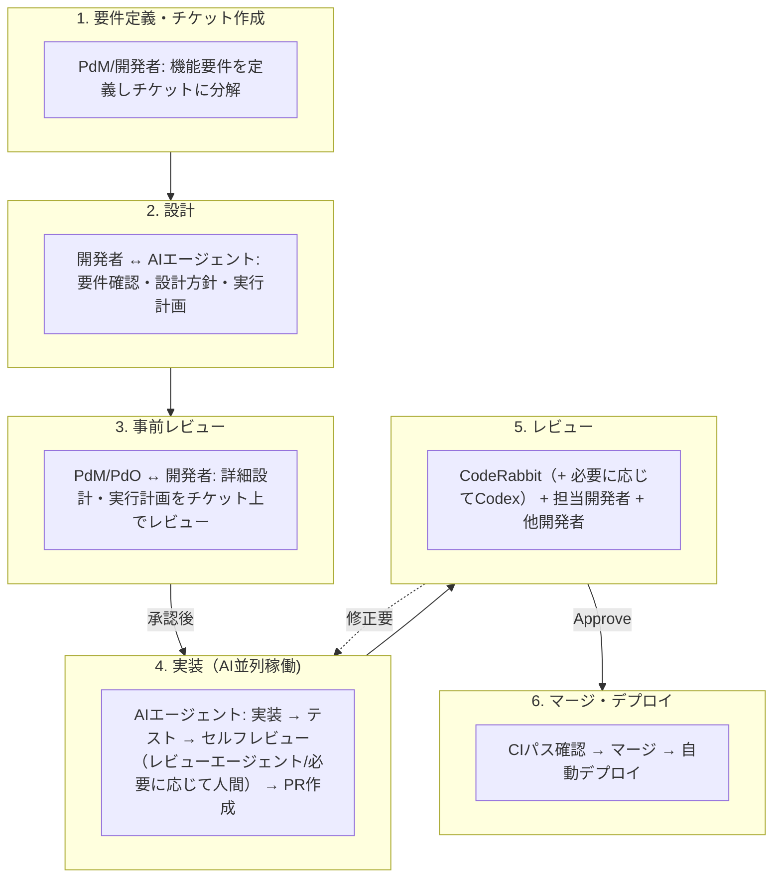

# 開発フロー

## 1. 概要

本ドキュメントは、DELISPECTプロジェクトにおける開発フローの概要を定義する。
詳細なチーム体制・役割・品質管理については [ADR-0002: AI駆動開発チーム体制](../decision-records/0002-ai-driven-development-team.md) を参照。

### 関連ドキュメント

- [ADR-0002: AI駆動開発チーム体制](../decision-records/0002-ai-driven-development-team.md) - 役割定義、品質ゲート、品質保証レベル
- [ブランチ戦略](./branching-strategy.md) - GitHub Flow、PR規約
- [チケット記述ガイドライン](./ticket-writing.md) - チケットの書き方

---

## 2. 開発サイクル

### 2.1 全体フロー

```
要件定義 → 設計 → チケット作成 → 事前レビュー → 実装 → レビュー → マージ → デプロイ
```

### 2.2 詳細フロー



> **本製品版ではLv.2（品質保証レベル）を適用。** 重要箇所は担当開発者がコードレビューを実施し、必要に応じて他開発者へレビューを依頼する。詳細は [ADR-0002 セクション5](../decision-records/0002-ai-driven-development-team.md#5-品質管理) を参照。

---

## 3. チケット管理

### 3.1 チケット構造

```
親チケット（要件）
├── 子チケット: 設計
└── 子チケット: 実装（設計完了後にタスク分割）
    ├── 実装タスク 1
    ├── 実装タスク 2
    └── ...
```

### 3.2 チケット粒度

1つのチケットは、以下の条件を満たす粒度とする:

- 1人のAIエージェントが完結できる
- 明確な完了条件がある
- 他チケットとの依存が最小限

> 詳細（テンプレート、ライフサイクル、依存関係）は [チケット記述ガイドライン](./ticket-writing.md) を参照
