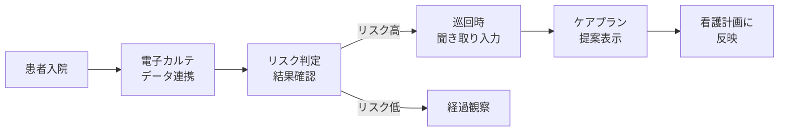
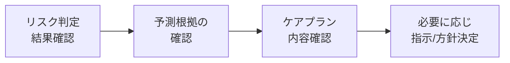

# ユーザーストーリー

## 1. 対象患者

- 急性期病院の一般病棟（ICU以外）に入院する患者
- 入院直後（2日以内）
- 手術前（術後せん妄は対象外）

## 2. 看護師の利用フロー

### 2.1 せん妄リスクの確認
- 看護師として、担当患者のせん妄発症リスク（高/低）を一覧で確認したい。それにより、ケアの優先度を判断できる。
- 看護師として、リスク判定の根拠となった因子を確認したい。それにより、どの症状に対してケアすべきか把握できる。

### 2.2 ケアプランの作成
- 看護師として、リスクの高い患者に対するケアプランの提案を受けたい。それにより、経験が浅くても適切なせん妄予防ケアを実施できる。
- 看護師として、巡回時に患者の聞き取り情報を入力し、その場でケアプランを確認したい。それにより、業務の流れを止めずに対応できる。
- 看護師として、過去のケアプラン提案履歴を確認したい。それにより、看護計画の作成に反映できる。

### 2.3 データ入力
- 看護師として、電子カルテの情報が自動連携されていてほしい。それにより、手入力の負荷を最小限に抑えられる。
- 看護師として、少ないステップでわかりやすい画面から追加情報を入力したい。それにより、業務中でも短時間で操作を完了できる。

## 3. 医師の利用フロー

- 医師として、担当患者のせん妄発症リスクと予測根拠を確認したい。それにより、治療方針の決定に活用できる。
- 医師として、提案されたケアプランの内容を確認したい。それにより、看護師のケア方針を把握し必要に応じて指示を出せる。

## 4. 病院管理者のユーザーストーリー

- 病院管理者として、ユーザーアカウントの管理を行いたい。それにより、適切なアクセス制御を維持できる。
- 病院管理者として、システムの利用状況を把握したい。それにより、運用改善の判断材料にできる。