# サイトマップ

## 画面一覧

| No. | 画面名 | 概要 | 対象ユーザー |
|-----|--------|------|-------------|
| 1 | ログイン画面 | ユーザー認証 | 全ユーザー |
| 2 | 患者入院一覧画面 | 入院患者の一覧表示・検索・操作 | 一般ユーザー・全権管理者 |
| 3 | 患者入院詳細画面 | 患者のバイタル・採血・リスク情報の詳細表示 | 一般ユーザー・全権管理者 |
| 4 | ケアプラン一覧画面 | ケアプラン項目の選択・実施状況表示 | 一般ユーザー・全権管理者 |
| 4-1 | ケアプラン作成：薬剤 | リスク薬剤の確認・代替提案 | 一般ユーザー・全権管理者 |
| 4-2 | ケアプラン作成：疼痛 | 痛みの確認・部位選択・生活影響 | 一般ユーザー・全権管理者 |
| 4-3 | ケアプラン作成：脱水 | 脱水の確認・対処提案 | 一般ユーザー・全権管理者 |
| 4-4 | ケアプラン作成：便秘 | 便秘の確認・対処提案 | 一般ユーザー・全権管理者 |
| 4-5 | ケアプラン作成：炎症 | 炎症の確認・対処提案 | 一般ユーザー・全権管理者 |
| 4-6 | ケアプラン作成：その他 | 離床・認知症・安全管理・睡眠 | 一般ユーザー・全権管理者 |
| 5 | ケアプラン詳細画面 | 入力内容・提案内容の一覧表示・印刷・転記 | 一般ユーザー・全権管理者 |
| 5-1 | ケアプラン詳細：薬剤 | 薬剤の入力内容・提案結果の表示 | 一般ユーザー・全権管理者 |
| 5-2 | ケアプラン詳細：疼痛 | 疼痛の入力内容・提案結果の表示 | 一般ユーザー・全権管理者 |
| 5-3 | ケアプラン詳細：脱水 | 脱水の入力内容・提案結果の表示 | 一般ユーザー・全権管理者 |
| 5-4 | ケアプラン詳細：便秘 | 便秘の入力内容・提案結果の表示 | 一般ユーザー・全権管理者 |
| 5-5 | ケアプラン詳細：炎症 | 炎症の入力内容・提案結果の表示 | 一般ユーザー・全権管理者 |
| 5-6 | ケアプラン詳細：その他 | 離床・認知症・安全管理・睡眠の表示 | 一般ユーザー・全権管理者 |
| 6 | カルテ転記画面 | ケアプラン内容を看護記録用テキストに変換・コピー | 一般ユーザー・全権管理者 |
| 7 | 電子カルテ同期画面 | 日付範囲指定・同期実行 | 一般ユーザー・全権管理者 |
| 8 | ユーザー管理画面 | ユーザーの一覧・登録・編集・削除 | 全権管理者 |
| 9 | 薬剤マスタ管理画面 | 薬剤マスタのCSVインポート | システム管理者・全権管理者 |
| 10 | 基準値マスタ管理画面 | バイタル・採血の基準値管理 | システム管理者・全権管理者 |
| 11 | システム設定画面 | 日次バッチ同期等のシステム設定 | システム管理者・全権管理者 |
| 12 | データマッピング画面 | 病院DBコードとシステム項目の対応付け | システム管理者・全権管理者 |
| 13 | 監査ログ画面 | ログの閲覧・検索 | システム管理者・全権管理者 |
| 14 | 解析用操作ログ画面 | 操作ログ・集計ダッシュボード | システム管理者・全権管理者 |
| 15 | 個人設定画面 | アカウント情報変更・パスワード変更 | 全ユーザー |

## 画面遷移

```mermaid
flowchart TD
    LOGIN[ログイン画面]
    LIST[患者入院一覧画面]
    DETAIL[患者入院詳細画面]
    CP_LIST[ケアプラン一覧]
    CP_MED[ケアプラン作成：薬剤]
    CP_PAIN[ケアプラン作成：疼痛]
    CP_DEH[ケアプラン作成：脱水]
    CP_CON[ケアプラン作成：便秘]
    CP_INF[ケアプラン作成：炎症]
    CP_OTH[ケアプラン作成：その他]
    CP_DETAIL[ケアプラン詳細]
    TRANSCRIBE[カルテ転記]
    CP_D_MED[ケアプラン詳細：薬剤]
    CP_D_PAIN[ケアプラン詳細：疼痛]
    CP_D_DEH[ケアプラン詳細：脱水]
    CP_D_CON[ケアプラン詳細：便秘]
    CP_D_INF[ケアプラン詳細：炎症]
    CP_D_OTH[ケアプラン詳細：その他]
    IMPORT[電子カルテ同期]
    ADMIN_USER[ユーザー管理]
    ADMIN_MED[薬剤マスタ管理]
    ADMIN_REF[基準値マスタ管理]
    ADMIN_SET[システム設定]
    ADMIN_MAP[データマッピング]
    ADMIN_LOG[監査ログ]
    SETTINGS[個人設定]

    LOGIN --> LIST

    LIST -->|患者名クリック| DETAIL
    LIST -->|ケア実施状況クリック| CP_LIST
    LIST -->|電子カルテ同期ボタン| IMPORT
    LIST -->|AIリスク判定ボタン| LIST

    subgraph 患者詳細サブメニュー
        DETAIL
        CP_LIST
        CP_DETAIL
        TRANSCRIBE
    end

    CP_LIST --> CP_MED
    CP_LIST --> CP_PAIN
    CP_LIST --> CP_DEH
    CP_LIST --> CP_CON
    CP_LIST --> CP_INF
    CP_LIST --> CP_OTH

    CP_DETAIL --> CP_D_MED
    CP_DETAIL --> CP_D_PAIN
    CP_DETAIL --> CP_D_DEH
    CP_DETAIL --> CP_D_CON
    CP_DETAIL --> CP_D_INF
    CP_DETAIL --> CP_D_OTH

    subgraph サイドメニュー
        NAV_LIST[患者入院一覧]
        NAV_ADMIN[管理]
        NAV_SETTINGS[個人設定]
    end

    NAV_LIST --> LIST
    NAV_ADMIN --> ADMIN_USER
    NAV_ADMIN --> ADMIN_MED
    NAV_ADMIN --> ADMIN_REF
    NAV_ADMIN --> ADMIN_SET
    NAV_ADMIN --> ADMIN_MAP
    NAV_ADMIN --> ADMIN_LOG
    NAV_ADMIN --> ADMIN_RESEARCH[解析用操作ログ]
    NAV_SETTINGS --> SETTINGS
```

## レイアウト

レイアウトおよびメニュー項目の詳細は [1.共通機能](5_functional_requirements/1_common.md) を参照。
