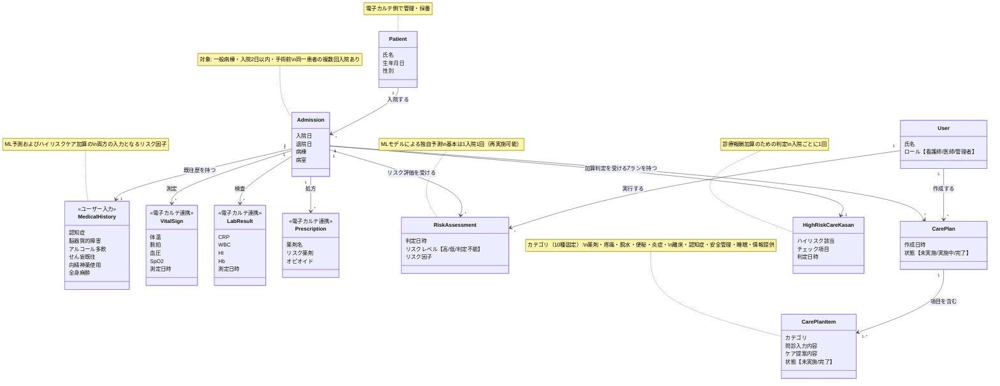
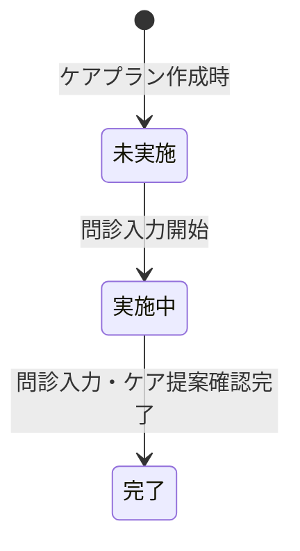

# ドメインモデル

## 概念モデル

本システムの業務領域における主要な概念とその関係を示す。

## 集約

概念モデルの操作単位（集約）を以下に示す。集約ルートを経由してデータの整合性を保証する。

| 集約 | ルート | 含まれるエンティティ | 備考 |
|---|---|---|---|
| 患者 | Patient | — | 電子カルテ側で管理される外部エンティティ |
| 入院 | Admission | MedicalHistory, VitalSign, LabResult, Prescription | 入院に紐づく臨床データを含む |
| リスク評価 | RiskAssessment | — | 入院を参照。MLモデルにより算出 |
| ケアプラン | CarePlan | CarePlanItem | 入院・リスク評価を参照 |
| 加算判定 | HighRiskCareKasan | — | 入院を参照 |
| ユーザー | User | — | 認証・認可の主体 |

## データの流れ

各プロセスが参照するデータの関係を示す。

### リスク評価（ML予測）

- **入力**: MedicalHistory（ユーザー入力）、VitalSign、LabResult、Prescription（電子カルテ連携）
- **出力**: RiskAssessment（リスクレベル・リスク因子）

### ケアプラン作成

- **前提**: RiskAssessment でリスク「高」と判定された患者が対象
- **入力**: CarePlanItem ごとの問診入力
- **出力**: カテゴリ別のケア提案

### ハイリスクケア加算判定

- **入力**: MedicalHistory（ユーザー入力）、Patient の生年月日から算出する70歳以上判定、Prescription から判定するリスク薬剤
- **出力**: HighRiskCareKasan（ハイリスク該当/非該当）

## 状態遷移

### ケアプラン項目（CarePlanItem）

### ケアプラン（CarePlan）

CarePlan の状態は CarePlanItem の状態から導出される。

| CarePlan の状態 | 条件 |
|---|---|
| 未実施 | 全 CarePlanItem が未実施 |
| 実施中 | 上記以外（一部でも実施中または完了がある） |
| 完了 | 全 CarePlanItem が完了 |

## 業務ルール

- 同一患者が複数回入院する場合があり、患者と入院日の組み合わせで識別する
- リスク評価（ML予測）は基本的に1入院1回実施する。データ連携の補完等により再実施が可能
- リスク評価で「高」と判定された患者を対象にケアプランを作成する
- せん妄ハイリスクケア加算判定は診療報酬の加算を目的とした判定であり、ケアプラン作成とは独立している
- MedicalHistory（既往歴・リスク因子）はユーザーが入力し、ML予測とハイリスクケア加算判定の両方の入力として使用される
- ハイリスクケア加算のチェック項目はMedicalHistory（ユーザー入力）に加え、70歳以上（Patient の生年月日から算出）とリスク薬剤（Prescription から判定）を含む
- ケアプラン項目のカテゴリは10種（薬剤・疼痛・脱水・便秘・炎症・離床・認知症・安全管理・睡眠・情報提供）で固定
- リスク評価に必要なバイタル・採血・処方データは電子カルテ連携で取得し、手入力は行わない
- ハイリスクケア加算の判定は入院ごとに1回行う
- 処方データは内服（処方オーダ）と注射（注射オーダ）の2種類があり、リスク薬剤の照合対象は内服が主となる
- リスク薬剤の判定には薬剤マスタを照合元として使用する
- バイタル・採血値の正常範囲は基準値マスタで管理し、性別ごとに上限・下限を設定する
