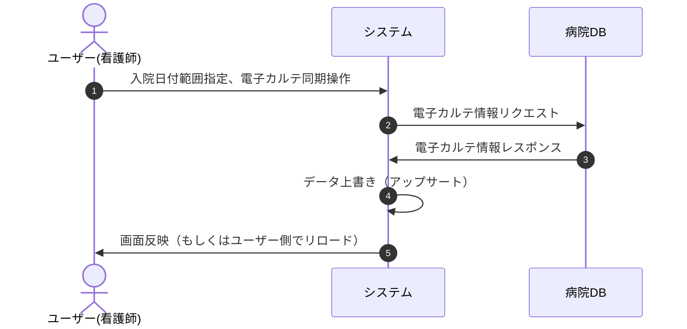
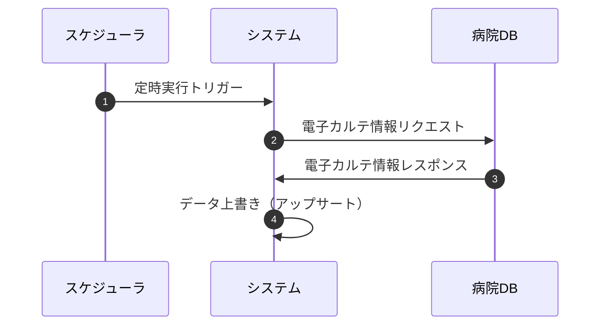

# 5.電子カルテ同期

## 機能概要
病院側のDWHやDBサーバーと連携して電子カルテ情報をインポートする。
本案件ではWebAPI連携でデータの同期をする想定。
インポートには手動インポート（ユーザー操作）と日次バッチインポート（自動実行）の2つの方式がある。

## 前提条件
- 電子カルテシステムとの連携が確立されていること

## 機能要件

### 5.1 手動インポート
電子カルテ同期画面に入院日付の範囲指定フォームと同期のトリガーとなるボタンを配置する。
開始日と終了日を指定し、電子カルテ同期ボタンで電子カルテ側APIにリクエストを送信する。
指定可能な範囲は最大7日間とする。
電子カルテ情報の入力ミスや不足情報があった場合に対応できるよう、ユーザーが任意のタイミングで実行できるものとする。
操作後に処理の成功/失敗が分かるような文言を表示する。

### 5.2 日次バッチインポート
毎日定時に自動実行し、直近の入院患者のデータを取得する。
- 実行タイミングは設定可能とする
- 対象の入院日付範囲は設定可能とする（デフォルト：実行日の2日前〜実行日）
- 実行結果（成功/失敗・処理件数）を監査ログに記録する
- 失敗時はリトライを行い、リトライ上限を超えた場合はエラーログを記録する

### 5.3 データ取得範囲
各患者入院レコードの入院日付を基準に、データ種別ごとに以下の期間のデータを取得する。

| データ種別 | 取得期間 |
|-----------|---------|
| 検査値（採血等） | 入院7日前 〜 入院日の翌日 |
| 処方 | 入院7日前 〜 入院日の翌日 |
| バイタルサイン | 入院日 〜 入院日の翌日 |

### 5.4 データ更新機能
電子カルテから取得したデータを既存データに上書き（アップサート）する。

### 5.5 排他制御
- インポート処理中は排他ロックを取得し、同時実行を防止する
- ロックは処理完了時に自動解放される
- 他ユーザーがインポート中の場合はエラーメッセージを表示する

## 制約条件
- 電子カルテシステムとの連携が必要
- 手動インポートの入院日付の範囲指定は最大7日間まで
- 手動インポートとバッチインポートは同一のデータ取得・アップサートロジックを使用する

## エラー処理
- 電子カルテ同期エラー時の処理
  - エラーが発生した場合、エラーメッセージと共に失敗したレコードの入院IDを一覧表示する
- データ更新エラー時の処理
  - 更新に失敗したレコードの入院IDを一覧表示する
- 入力値エラー時の処理
  - 日付範囲が不正な場合、エラーメッセージを表示する
  - 指定可能な範囲を超える場合、エラーメッセージを表示する

## シーケンス図

### 手動インポート

### 日次バッチインポート

