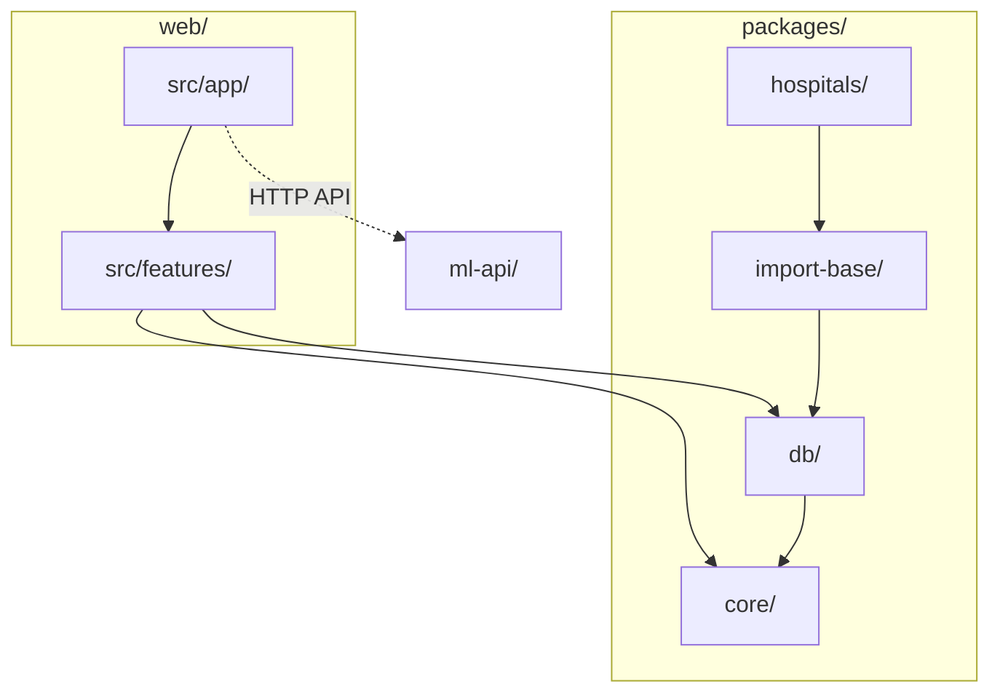

# ディレクトリ設計ガイドライン

## 1. 概要

本ドキュメントは、DELISPECTのMonorepo構成におけるディレクトリ設計のルールを定義する。
各パッケージの責務、依存関係、病院別カスタマイズの追加手順を統一する。

### 関連ドキュメント

- [コーディングガイドライン](./coding-guidelines.md) - フロントエンド層の構成
- [ADR#0001: Monorepo + TypeScript統一（ML除く）](../decision-records/0001-monorepo-typescript.md) - 採用決定の背景

---

## 2. リポジトリ構成

### 2.1 全体構成

```
delispect-app/
├── web/                          # Next.js Webアプリケーション
│   └── src/
│       ├── features/             # 機能別ディレクトリ
│       ├── shared/               # 共通コード
│       ├── lib/                  # ライブラリ設定
│       └── app/                  # Next.js App Router
├── packages/
│   ├── core/                     # 共通型定義・ユーティリティ
│   ├── db/                       # DBクライアント・リポジトリ
│   ├── import-base/              # インポート共通基盤
│   └── hospitals/                # 病院別インポート実装
│       ├── juntendo/
│       ├── shinjo/
│       └── _template/
├── ml-api/                       # Python ML API（リスク判定）
├── package.json                  # ワークスペース設定
└── tsconfig.base.json
```

### 2.2 各ディレクトリの責務

| ディレクトリ | 責務 |
|-------------|------|
| `web/` | Next.js Webアプリケーション（UI、Server Actions） |
| `packages/core/` | 共通型定義、ビジネスロジック、ユーティリティ |
| `packages/db/` | DBクライアント、リポジトリ層 |
| `packages/import-base/` | インポート共通基盤（抽象クラス、共通DTO） |
| `packages/hospitals/` | 病院別インポート実装 |
| `ml-api/` | Python ML API（リスク判定） |

### 2.3 ML API（Python）

ML APIは独立したサービスとしてHTTP APIで連携する。

---

## 3. 依存関係ルール

### 3.1 依存方向の原則

依存は **上位レイヤー → 下位レイヤー** の一方向のみ許可する。



### 3.2 許可される依存関係

| パッケージ | 依存可能先 |
|-----------|-----------|
| `packages/core` | 外部ライブラリのみ（内部依存なし） |
| `packages/db` | `@delispect/core` |
| `packages/import-base` | `@delispect/core`, `@delispect/db` |
| `packages/hospitals/*` | `@delispect/import-base` |
| `web` | `@delispect/core`, `@delispect/db` |

### 3.3 禁止事項

- **循環依存の禁止**: A → B → A のような循環は禁止
- **逆方向依存の禁止**: `core` が `db` に依存するなど
- **病院間の依存禁止**: `hospitals/juntendo` が `hospitals/shinjo` に依存するなど

---

## 4. パッケージ内部構造

### 4.1 packages/core/ の構成

```
packages/core/
├── src/
│   ├── index.ts              # エントリーポイント（re-export）
│   ├── types/                # 型定義
│   │   ├── patient.ts
│   │   ├── admission.ts
│   │   └── index.ts
│   ├── utils/                # ユーティリティ関数
│   │   └── index.ts
│   └── constants/            # 定数
│       └── index.ts
├── package.json
└── tsconfig.json
```

### 4.2 packages/db/ の構成

```
packages/db/
├── src/
│   ├── index.ts              # エントリーポイント
│   ├── client.ts             # DBクライアント
│   └── repositories/         # リポジトリ層
│       ├── patientRepository.ts
│       └── index.ts
├── prisma/
│   └── schema.prisma
├── package.json
└── tsconfig.json
```

### 4.3 packages/hospitals/{hospital}/ の構成

```
packages/hospitals/juntendo/
├── src/
│   ├── index.ts              # エントリーポイント
│   ├── config.ts             # 病院固有設定
│   ├── models/               # 電子カルテモデル定義
│   │   └── patient.ts
│   ├── transforms/           # 変換関数
│   │   └── patientTransform.ts
│   └── repository.ts         # 外部DB接続
├── package.json
└── tsconfig.json
```

---

## 5. 病院追加手順

### 5.1 追加手順

1. `packages/hospitals/_template` からコピーして作成
2. ディレクトリ名を病院識別子に変更
3. `package.json` の name を変更（`@delispect/hospital-{name}`）
4. `config.ts` に病院固有設定を定義
5. 電子カルテのモデル定義を追加
6. 変換関数を実装（transforms/）
7. Repositoryを実装（外部DB接続）
8. 単体テストを追加

---

## 6. パッケージのインポート

### 6.1 パッケージ名

```json
{
  "@delispect/core": "workspace:*",
  "@delispect/db": "workspace:*",
  "@delispect/import-base": "workspace:*",
  "@delispect/hospital-juntendo": "workspace:*"
}
```

### 6.2 インポート例

```typescript
// パッケージからのインポート
import { Patient } from '@delispect/core';
import { prisma } from '@delispect/db';
import { BaseImporter } from '@delispect/import-base';
```

---

## 7. ビルドと開発

### 7.1 開発コマンド

```bash
# 全体
npm install                # 依存関係インストール
npm run build              # 全パッケージビルド
npm run test               # 全テスト実行

# web のみ
npm run dev -w web         # 開発サーバー起動

# 特定パッケージ
npm run build -w @delispect/core
npm run test -w @delispect/db
```
