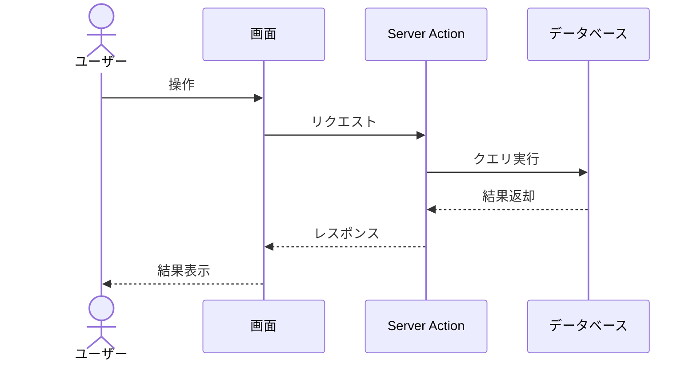
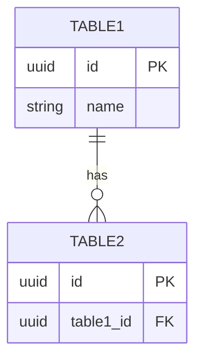

# [機能名] 機能設計書

## 概要

QMS設計書対応番号：DEL-DEV-FUN-XXX

<!-- この機能の概要を簡潔に記載 -->

## 前提条件

<!-- この機能を利用するための前提条件 -->
- ユーザーがログインしていること
-

## 機能仕様

### ユースケース

| ユースケースID | ユースケース名 | アクター | 概要 |
|----------------|----------------|----------|------|
| UC001 | | | |
| UC002 | | | |

### 処理フロー

#### [処理名1]

<!-- 処理の流れをステップで記載 -->

1. ステップ1
2. ステップ2
3. ステップ3



### ビジネスロジック

#### データ検証ルール

| 項目 | 検証ルール | エラーメッセージ |
|------|------------|------------------|
| | | |

#### [計算ロジック等]

<!-- 業務上の計算ロジックやステータス遷移等を記載 -->

## 画面設計

<!-- 画面がない機能（バッチ処理等）の場合はこのセクションを省略 -->

### [画面名1]

- フォーム項目
    - 項目1（説明）
    - 項目2（説明）
- ボタン/アクション
    - ボタン1の動作説明

### 表示項目

| 大項目 | 項目名 | 説明 | 備考 |
|--------|--------|------|------|
| | | | |

## Server Actions

### [アクション名]（[関数名]）

#### 入力

| パラメータ | 型 | 必須 | 説明 |
|----------|------|------|------|
| param1 | string | ○ | |
| param2 | number | - | |

#### 出力

```typescript
{
  field1: string;
  field2: number;
}
```

#### 処理

1. 入力値検証
2. メイン処理
3. 監査ログ記録（`[イベント種別]`）

## データモデル

### 使用テーブル

| テーブル | 役割 |
|---------|------|
| | |

### ER図（機能スコープ）



### ステータス定義

<!-- 必要に応じてステータスや種別の定義を記載 -->

| ステータス | 説明 |
|-----------|------|
| | |

**ステータス遷移**:
- `status1` → `status2`: 遷移条件

## 非機能要件

### 性能要件

| 処理 | 目標 |
|------|------|
| 画面表示 | 2秒以内 |
| データ更新 | 3秒以内 |

### セキュリティ対策

- 認証済みユーザーのみアクセス可能
- 操作ログの記録

## 監査ログ

| イベント種別 | 記録タイミング | 記録内容 |
|-------------|---------------|----------|
| | | |

## エラー処理

| エラーコード | エラーメッセージ | 発生条件 | 対応方法 |
|--------------|------------------|----------|----------|
| E001 | | | |
| E002 | | | |

## 関連ドキュメント

- 要件定義:
- 画面設計:
- テーブル定義:
